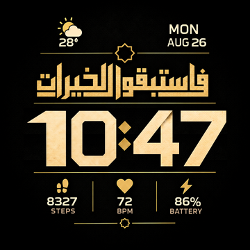

# Fastabiqulkhairat

Watchface Amazfit T-Rex Pro 360 x 360, memakai kaligrafi dan aset visual yang diberikan pengguna.



[Binary](out/fastabiqulkhairat.bin) | [Skenario waktu](out/scenarios.png) | [Digit yang diseragamkan](out/digits-normalized.png) | [Laporan verifikasi](out/validation.json)

## Desain dan aset

- `reference/approved-design.png`: desain final pengguna. Kaligrafi, ornamen, garis, ikon metrik, dan label diambil langsung dari gambar ini. Tidak diketik ulang atau digambar ulang.
- `reference/digits-approved.jpg`: lembar digit pengguna. Seluruh digit besar diambil dari lembar ini; angka 4 memakai varian lipatan pada baris kedua.
- Atas permintaan pengguna, badan digit diseragamkan menjadi 66 x 81 px dalam sel 68 x 81 px. Angka 1 tetap ramping, 38 x 81 px dalam sel yang sama. Tekstur emas dan bentuk dasar dipertahankan. Normalisasi ini merupakan perubahan proporsi yang diminta pengguna.
- Titik dua berasal dari desain final. Area angka statis dibersihkan menggunakan tekstur gelap dari gambar yang sama, lalu diisi aset dinamis.
- Digit kecil yang tersedia di desain dipotong langsung; digit kecil lainnya berasal dari lembar digit. MON dan AUG juga dipotong langsung. Nama hari/bulan lain memakai font pendukung Rajdhani, sedangkan kondisi cuaca lain memakai ikon programatis karena aset lengkapnya tidak terdapat dalam lampiran.

Gambar sumber disimpan tanpa perubahan. Build memeriksa hash sumber dan kesamaan piksel area kaligrafi pada latar 360 x 360. File font Noto Kufi Arabic dan Oxanium serta tekstur generasi lama masih tersimpan untuk riwayat, tetapi tidak dipakai untuk kaligrafi atau jam pada build ini.

## Waktu rata tengah

`design.json` mendefinisikan satu field waktu pada x=180. Jam tanpa nol awal, menit dua digit. Contoh: `9:07`, `10:47`, `1:11`.

Format UIHH v2 memerlukan entri jam dan menit, tetapi keduanya terhubung menjadi satu grup: jam berperataan `Center`, titik dua sebagai `SuffixImage`, dan menit `Independent: false`. Posisi jam memperhitungkan seluruh lebar menit dan titik dua.

Sel digit 68 px dan titik dua 22 px menghasilkan lebar 226 px untuk waktu tiga digit (x=67) dan 294 px untuk empat digit (x=33). Keduanya berpusat pada x=180. Seluruh 1.440 kombinasi waktu 24 jam diperiksa. Geometri yang diperiksa adalah sel aset; bentuk angka 1 tetap lebih ramping di dalam selnya.

## Build dan validasi

```powershell
python tools/build.py
```

Memerlukan Python dan Pillow. Tidak diperlukan pembentukan font Arab atau imagegen untuk build. Proses membuat aset, mengemas binary UIHH v2 terkompresi, membongkar kembali binary, membandingkan parameter dan semua piksel, lalu merender preview dari hasil pembongkaran.

AOD mempertahankan seluruh elemen. Intensitas kanal RGB angka jam, menit, dan titik dua adalah 45%; elemen lainnya 30%. Data dinamis: hari, bulan, tanggal, suhu, kondisi cuaca, langkah, detak jantung, dan baterai. Kesegaran data bergantung pada firmware.

Target adalah T-Rex Pro generasi awal. Instalasi fisik dan perilaku firmware, termasuk grup waktu dan pembaruan AOD, belum diuji pada jam. Hasil uji perangkat lunak tersedia di `out/validation.json`.

## Lisensi dan sumber teknis

Kode turunan skema [watchface-js](https://github.com/Nadeflore/watchface-js) mengikuti GPL-3.0, lihat `LICENSE` dan `tools/LICENSE.watchface-js`. Packer diadaptasi dari baseline lokal TEL-U T-Rex Pro. Semantik digit mengikuti [editor SashaCX75](https://github.com/SashaCX75/AmazFit_Watchface_Editor_2/blob/master/GTR_Watch_face/PreviewToBitmap.cs).

Font yang tersimpan berlisensi SIL OFL, salinan lisensi ada di `assets/fonts`. Desain dan lembar digit diberikan pengguna; lisensi kode tidak dimaksudkan sebagai klaim kepemilikan karya visual pihak lain.
