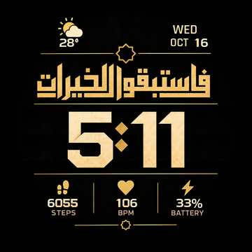
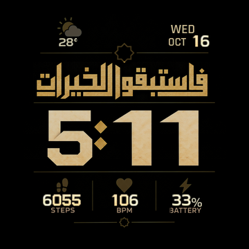

# ✨ Fastabiqulkhairat | Pengingat kebaikan di pergelangan tangan

Sekilas melihat jam, sejenak mengingat kebaikan. **Fastabiqulkhairat** hadir
dengan kaligrafi, angka keemasan, dan latar hitam untuk **Amazfit T-Rex Pro
(360 x 360)**. Semoga menjadi teman kecil untuk mengisi waktu dengan hal baik.


**[⬇️ Unduh watchface](out/fastabiqulkhairat.bin)** · [🖼️ Lihat skenario waktu](out/scenarios.png) · [Laporan verifikasi](out/validation.json)

## 🌙 Yang menemani harimu

- **Kaligrafi sebagai pusat perhatian**, dengan ornamen dan nuansa emas di atas latar gelap.
- **Jam besar dengan bentuk angka khas**, disusun sebagai satu grup waktu yang rata tengah pada preview.
- **Informasi harian tetap dekat:** hari, tanggal, bulan, suhu, dan kondisi cuaca.
- **Langkah, detak jantung, dan baterai** untuk dilirik di sela aktivitas.
- **Always-on tetap lengkap**, dengan latar dan ornamen lebih redup serta angka metrik dan tanggal yang diperbesar.

## 🖼️ Galeri tampilan

| Tampilan utama ✨ | Always-on 🌙 |
| :---: | :---: |
|  |  |

[Lihat variasi waktu lainnya](out/scenarios.png) atau [lembar bentuk angka](out/digits-normalized.png).
Semua gambar ini adalah preview dari hasil build. **Instalasi fisik, perataan
waktu pada firmware, dan pembaruan AOD belum diuji pada jam.**

## ⌚ Cara pasang

1. Buka [file Fastabiqulkhairat](out/fastabiqulkhairat.bin), lalu klik **Download raw file** untuk menyimpan `.bin`.
2. Siapkan aplikasi pemasang watchface lokal, misalnya AmazFaces, dan pilih **Amazfit T-Rex Pro**.
3. Gunakan menu file lokal untuk memilih `.bin` tadi. Nama menu mengikuti versi aplikasi yang dipakai.
4. Ikuti petunjuk aplikasi sampai selesai, lalu periksa tampilan, waktu, dan metrik pada jam.

Paket ini memakai format legacy **UIHH v2** untuk T-Rex Pro generasi awal.
Panduan ini merupakan alur pemasangan yang perlu dicoba pada perangkat;
belum ada konfirmasi instalasi fisik untuk edisi ini.

## 🛠️ Di balik tampilannya

Bagian berikut menyimpan rincian aset, build, dan batas verifikasi untuk
yang ingin mengutak-atik desainnya sendiri.

## Desain dan aset

- `reference/approved-design.png`: desain final pengguna. Kaligrafi, ornamen, garis, ikon metrik, dan label diambil langsung dari gambar ini. Tidak diketik ulang atau digambar ulang.
- `reference/digits-approved.jpg`: lembar digit pengguna. Seluruh digit besar diambil dari lembar ini; angka 4 memakai varian lipatan pada baris kedua.
- Proporsi badan digit memakai tinggi 81 px dan lebar 66 px, kecuali angka 1 yang tetap ramping pada 38 px. Semua aset memiliki margin transparan 1 px di kiri dan kanan: sel 68 x 81 px untuk digit lain dan 40 x 81 px untuk angka 1. Jarak dirapikan dengan memangkas padding, bukan melebarkan bentuk angka 1.
- Titik dua berasal dari desain final. Area angka statis dibersihkan menggunakan tekstur gelap dari gambar yang sama, lalu diisi aset dinamis.
- Digit kecil yang tersedia di desain dipotong langsung; digit kecil lainnya berasal dari lembar digit. MON dan AUG juga dipotong langsung. Nama hari/bulan lain memakai font pendukung Rajdhani, sedangkan kondisi cuaca lain memakai ikon programatis karena aset lengkapnya tidak terdapat dalam lampiran.

Gambar sumber disimpan tanpa perubahan. Build memeriksa hash sumber dan kesamaan piksel area kaligrafi pada latar 360 x 360. File font Noto Kufi Arabic dan Oxanium serta tekstur generasi lama masih tersimpan untuk riwayat, tetapi tidak dipakai untuk kaligrafi atau jam pada build ini.

## Satu field waktu, rata tengah

`design.json` mendefinisikan satu `time_field` dengan `alignment: Center` dan `center_x: 180`. `compile_time_field()` menerjemahkannya ke komponen terkait yang diwajibkan UIHH: jam, suffix titik dua, dan menit dengan `Independent: false`. Komponen menit tidak memiliki posisi terpisah yang dipatok.

Renderer menyusun seluruh glyph jam, titik dua, dan menit terlebih dahulu. Lebar grup dihitung dari ukuran aktual aset, termasuk angka 1 yang bersel 40 px. Posisi kiri dihitung dari `(360 - lebar_grup) / 2`. Contoh: 5:11 dimulai pada x=95, 11:11 pada x=89, dan 21:10 pada x=61. Semuanya berpusat pada x=180. Build memeriksa 2.880 skenario normal dan AOD.

**Koreksi atas laporan sebelumnya:** pergeseran 14/28 px berasal dari model preview yang hanya memusatkan jam. Itu belum membuktikan batas firmware. [Pengembang editor SashaCX75](https://amazfitwatchfaces.com/forum/viewtopic.php?p=13168) memperingatkan bahwa preview Center/Right bersama Follow tidak akurat dan perlu diperiksa pada jam.

Parameter native jam `Center` dan menit `Follow` sudah ada pada binary sebelumnya. Revisi pengelompokan ini membetulkan renderer dan sumber konfigurasi, tanpa mengklaim mengubah perilaku firmware. Binary tetap identik dengan revisi 81df71f. Model preview seluruh grup kini terpusat, tetapi perataan pada firmware belum diverifikasi. `out/validation.json` memisahkan verifikasi preview dari `firmware_centering_verified`.

## Build dan validasi

Audit teknis daya dan kandidat pengemasan aset tersedia di [POWER_AUDIT.md](POWER_AUDIT.md).
[Kandidat optimized](out/fastabiqulkhairat-optimized.bin) mempertahankan seluruh piksel AOD,
tetapi penghematan baterai dan kompatibilitas offset bersama pada jam belum terukur.
Binary utama tetap tersedia sebagai pembanding. Build menghasilkan kedua varian.

```powershell
python tools/build.py
```

Memerlukan Python dan Pillow. Tidak diperlukan pembentukan font Arab atau imagegen untuk build. Proses membuat aset, mengemas binary UIHH v2 terkompresi, membongkar kembali binary, membandingkan parameter dan semua piksel, lalu merender preview dari hasil pembongkaran.

AOD mempertahankan seluruh elemen. Intensitas kanal RGB angka jam, menit, dan titik dua adalah 85%. Teks dan angka lainnya, termasuk tanggal, suhu, metrik, satuan, label, dan kaligrafi, memakai 80%. Ikon, ornamen, dan latar tetap 30%. Khusus angka langkah, BPM, baterai, dan tanggal pada AOD, sel diperbesar dari 11 x 13 menjadi 14 x 18 px dengan intensitas 100%. Label, nama hari/bulan, dan simbol persen tidak diperbesar. Posisi angka disesuaikan agar tetap terpisah dari ikon serta label. Data dinamis: hari, bulan, tanggal, suhu, kondisi cuaca, langkah, detak jantung, dan baterai. Kesegaran data bergantung pada firmware.

Target adalah T-Rex Pro generasi awal. Instalasi fisik dan perilaku firmware, termasuk grup waktu dan pembaruan AOD, belum diuji pada jam. Hasil uji perangkat lunak tersedia di `out/validation.json`.

## Lisensi dan sumber teknis

Kode turunan skema [watchface-js](https://github.com/Nadeflore/watchface-js) mengikuti GPL-3.0, lihat `LICENSE` dan `tools/LICENSE.watchface-js`. Packer diadaptasi dari baseline lokal TEL-U T-Rex Pro. Semantik digit mengikuti [editor SashaCX75](https://github.com/SashaCX75/AmazFit_Watchface_Editor_2/blob/master/GTR_Watch_face/PreviewToBitmap.cs).

Font yang tersimpan berlisensi SIL OFL, salinan lisensi ada di `assets/fonts`. Desain dan lembar digit diberikan pengguna; lisensi kode tidak dimaksudkan sebagai klaim kepemilikan karya visual pihak lain.

Dibuat oleh [@fathahnoor](https://github.com/fathahnoor). Semoga setiap lirikan
ke jam menjadi pengingat untuk menyempatkan satu kebaikan lagi. 🌿
