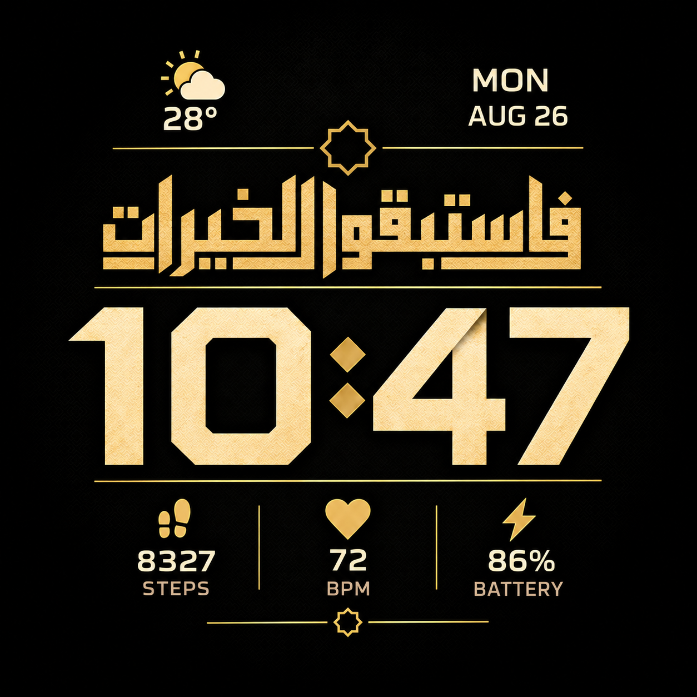

# Fastabiqulkhairat

Watchface emas dan hitam untuk Amazfit T-Rex Pro, layar bulat 360 x 360.

## Desain final pengguna



Gambar `reference/approved-design.png` adalah acuan final yang diberikan pengguna pada 16 September 2026. File disalin persis, tanpa perubahan piksel. Kaligrafi, font angka, tekstur emas, ikon, dan tata letaknya harus dipertahankan. Jangan mengganti dengan font lain, mengetik ulang kaligrafi, atau meregenerasi desain.

**Binary dan preview di bawah adalah versi sebelumnya yang ditolak pengguna, bukan implementasi desain final.** Generator `tools/build.py` masih menghasilkan versi lama. Penggantian aset runtime menunggu sumber digit lengkap yang sesuai desain final. Gambar final hanya menyediakan digit waktu 1, 0, 4, dan 7; digit 2, 3, 5, 6, 8, dan 9 tidak boleh ditebak. Diperlukan aset font atau sprite 0-9, idealnya juga aset data kecil dan ikon cuaca.

Syarat waktu tetap berlaku: jam, titik dua, dan menit harus terpusat sebagai satu grup. Catatan berikut hanya mendokumentasikan build sebelumnya.

## Build sebelumnya, belum sesuai desain final


[Unduh binary](out/fastabiqulkhairat.bin) | [Semua skenario](out/scenarios.png) | [Hasil verifikasi](out/validation.json)

## Kaligrafi

Teks sumber adalah **فاستبقوا الخيرات**. Lafaz berharakat: **فَاسْتَبِقُوا الْخَيْرَاتِ**. Desain memakai versi tanpa harakat agar titik huruf terbaca jelas pada layar kecil.

Kaligrafi dibentuk dari Unicode menggunakan Noto Kufi Arabic dengan RAQM/HarfBuzz. Huruf tidak diambil dari gambar AI. Titik huruf: fa satu di atas, ta dua di atas, ba satu di bawah, qaf dua di atas, kha satu di atas, ya dua di bawah, dan ta terakhir dua di atas. Total 11 titik huruf. Alif, sin, waw, lam, dan ra tidak bertitik. Ornamen bintang berada di luar baris tulisan.

## Waktu sebagai satu field

`design.json` memiliki satu `time_field`, rata tengah pada x=180. Jam tidak memakai nol awal, menit selalu dua digit: `9:07`, `10:47`, `1:11`.

UIHH v2 menyimpan jam dan menit sebagai dua entri. Compiler memakai satu grup terhubung: jam `Center`, titik dua sebagai `SuffixImage` jam, dan menit `Independent: false` agar mengikuti jam. Posisi jam memperhitungkan lebar titik dua dan menit. Tidak ada titik dua statis di latar atau posisi menit yang dipatok terpisah. Field `Separator` berkoordinat tetap sengaja tidak digunakan karena bukan suffix yang mengikuti angka.

Dengan digit selebar 58 px dan separator 16 px, grup tiga digit memiliki lebar 190 px dan dimulai pada x=85. Grup empat digit memiliki lebar 248 px dan dimulai pada x=56. Keduanya berpusat pada x=180. Seluruh 1.440 kombinasi waktu 24 jam diperiksa oleh build. Perilaku firmware fisik tetap perlu diuji pada jam.

## Data dan AOD

Hari, bulan, tanggal, suhu, kondisi cuaca, langkah, detak jantung, dan baterai memakai data perangkat. AOD mempertahankan semua elemen dengan bitmap yang diredupkan menjadi 30% intensitas kanal RGB. Kesegaran data AOD mengikuti firmware.

## Build

Gunakan Python dan Pillow dengan RAQM yang sudah tersedia:

```powershell
python tools/build.py
```

Build membuat aset, preview 220 x 220, binary UIHH v2 terkompresi, membongkar ulang binary, membandingkan parameter dan seluruh piksel, serta menghasilkan enam preview dari data hasil pembongkaran. Batas perbedaan kanal piksel adalah 8; nilai aktual dicatat pada laporan.

File `.bin` ini menargetkan T-Rex Pro generasi awal, bukan T-Rex 2 atau T-Rex 3. Pengujian instalasi dan perilaku waktu langsung pada perangkat belum dilakukan.

## Sumber dan lisensi

- Referensi visual: `reference/design.png`, diberikan pengguna. Tekstur baru dibuat dengan imagegen; kaligrafi dan UI disusun oleh generator.
- [Noto Kufi Arabic](https://github.com/google/fonts/tree/main/ofl/notokufiarabic), [Oxanium](https://github.com/google/fonts/tree/main/ofl/oxanium), dan [Rajdhani](https://github.com/google/fonts/tree/main/ofl/rajdhani): SIL OFL, salinan lisensi di `assets/fonts`.
- Packer berasal dari proyek lokal TEL-U T-Rex Pro. Skema diadaptasi dari [watchface-js](https://github.com/Nadeflore/watchface-js), GPL-3.0. Lisensi disertakan di `tools/LICENSE.watchface-js`; kode turunan mengikuti GPL-3.0.
- Semantik `Follow` dan perataan digit dirujuk dari [PreviewToBitmap.cs](https://github.com/SashaCX75/AmazFit_Watchface_Editor_2/blob/master/GTR_Watch_face/PreviewToBitmap.cs) dalam editor SashaCX75. Preview perangkat lunak bukan bukti instalasi fisik.
